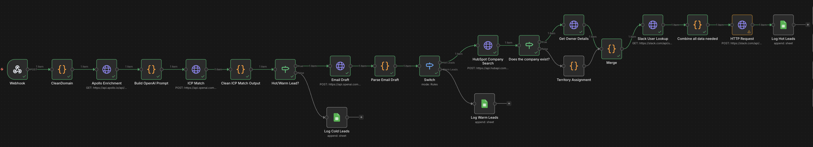
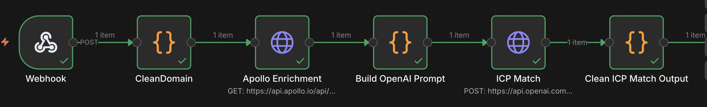
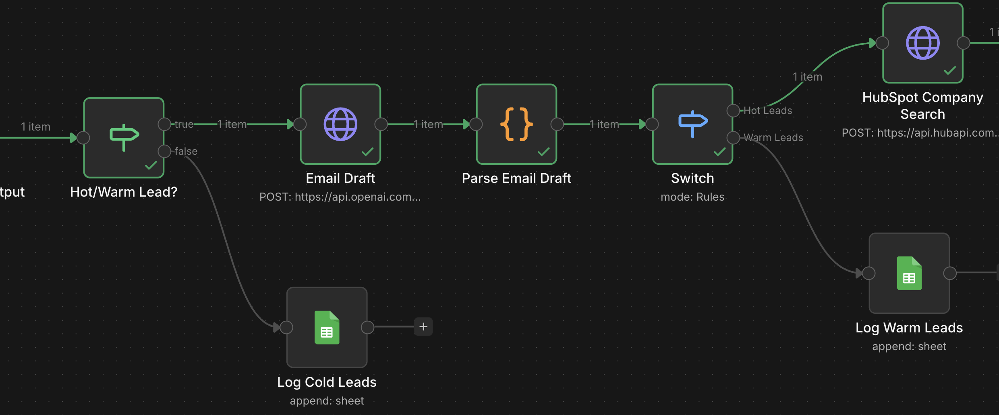
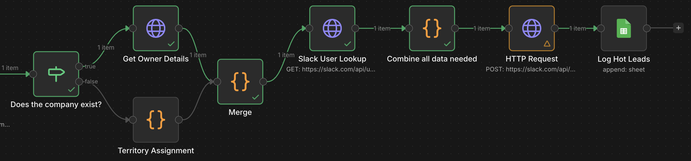

# Inbound Lead Scoring & Routing Workflow

End-to-end n8n workflow that handles inbound leads from form submission to sales rep notification, enriches the company via Apollo, scores it against an ICP using OpenAI, routes hot leads to the correct account owner with a ready-to-send email draft, and logs every lead by tier for downstream reporting.

It is a production-grade GTM automation pattern using n8n, Apollo, OpenAI, HubSpot, Slack, and Google Sheets.

---

## What It Does

When a prospect submits a form, the workflow runs end-to-end in under 30 seconds and:

1. **Enriches** the company with Apollo (industry, headcount, revenue, tech stack, funding stage)
2. **Scores** the company against a defined ICP using OpenAI (`gpt-4o`); returns fit score, tier (Hot / Warm / Cold), reasoning, ICP matches, gaps, suggested action, and a personalisation hook
3. **Drafts** a tailored outreach email when the lead is Hot or Warm, grounded in the ICP analysis and the prospect's role
4. **Routes** Hot leads to the correct account owner, looking up the existing HubSpot owner if the company is already in CRM, or assigning by territory rules if not
5. **Notifies** the assigned rep on Slack with the lead summary, fit reasoning, and the draft email ready to copy-paste
6. **Logs** every lead — Hot, Warm, and Cold — to separate Google Sheets tabs for downstream reporting and pipeline analysis

---

## Workflow Overview



The workflow is structured in three phases:

### Phase 1 — Enrichment & Scoring



The webhook receives form submissions, the domain is cleaned and normalised, Apollo enriches the company, and a structured prompt is built and sent to OpenAI for ICP evaluation. The OpenAI response is parsed into a clean object with `fit_score`, `fit_tier`, `fit_reasoning`, `icp_matches`, `icp_gaps`, `suggested_action`, and `personalization_hook`.

### Phase 2 — Email Draft & Tier Routing



A conditional checks whether the lead qualifies as Hot or Warm. If yes, a second OpenAI call drafts a personalised outreach email using the ICP scoring output as context. If no, the lead is logged as Cold and the workflow exits. Hot and Warm leads then split via a Switch node, Hot leads continue to owner routing, Warm leads are logged for nurture sequencing.

### Phase 3 — Owner Routing & Slack Notification



For Hot leads, the workflow checks whether the company already exists in HubSpot. If it does, the existing owner is fetched. If not, an owner is assigned via territory rules (geography, company size, or round-robin — configurable). The owner's Slack handle is looked up, a notification is posted to the rep with the lead summary, fit reasoning, and the pre-drafted email, and the lead is logged to the Hot Leads sheet.

---

## Stack

| Layer | Tool | Purpose |
|---|---|---|
| Orchestration | **n8n** | Workflow engine |
| Trigger | **Webhook** | Receives form submissions |
| Enrichment | **Apollo API** | Company firmographics + tech stack |
| Scoring & drafting | **OpenAI API** (`gpt-4o`) | ICP evaluation and email generation |
| CRM | **HubSpot API** | Owner lookup and company existence check |
| Notifications | **Slack API** | Rep alerts with draft email |
| Logging | **Google Sheets** | Tier-based lead logs for reporting |

---

## Why These Design Choices

**Three log destinations, not one.** Hot, Warm, and Cold leads go to separate tabs. This is intentional, different tiers require different downstream actions (immediate outreach vs. nurture sequence vs. quarterly re-scoring), and separating them at the source makes pipeline reporting trivial.

**Email draft happens before owner routing.** The draft is generated for any Hot or Warm lead regardless of routing path. This means the rep receives a ready-to-send message in Slack, removing the single biggest source of inbound response delay, the cognitive cost of writing the first reply.

**Existing-company check before territory assignment.** If a company is already in HubSpot, the existing owner takes precedence over territory rules. This prevents accidental ownership conflicts when an existing account submits a new inbound, a common edge case that pure territory-based routing gets wrong.

**Structured JSON output from OpenAI.** Both LLM calls use `response_format: { type: "json_object" }` with explicit schema in the system prompt. This eliminates parsing failures and makes the workflow deterministic enough for production use.

**Confidence-friendly logging.** Every lead, including Cold, is logged with the full ICP reasoning. This creates an auditable record for ICP refinement: if Cold leads start converting, the data is there to diagnose why and update the ICP definition.

---

## Setup

### Prerequisites

- - n8n instance (Cloud or self-hosted — workflow is portable across both)
- API keys: Apollo, OpenAI, HubSpot, Slack
- Google Sheets with three tabs: `Hot Leads`, `Warm Leads`, `Cold Leads`

### Import the workflow

1. Download `full_n8n_workflow.json` from this repo
2. In n8n: **Workflows → Import from File** → select `full_n8n_workflow.json`
3. Open each credential-bound node and connect your own credentials:
   - Apollo Enrichment (Header Auth)
   - Build OpenAI Prompt + Email Draft (OpenAI API)
   - HubSpot Company Search + Get Owner Details (HubSpot OAuth2 or API key)
   - Slack User Lookup + Slack notification (Slack OAuth2)
   - Log Hot/Warm/Cold Leads (Google Sheets OAuth2)
4. Update the ICP definition in the **Build OpenAI Prompt** node to match your business
5. Update the territory rules in the **Territory Assignment** node
6. Activate the workflow and copy the webhook URL into your form

### Sample webhook payload

```json
{
  "first_name": "Jane",
  "last_name": "Doe",
  "email": "jane.doe@examplecompany.com",
  "job_title": "VP of Revenue Operations",
  "company_website": "https://examplecompany.com",
  "message": "Looking for help scaling our outbound motion."
}
```

---

## What I'd Add Next

A few extensions worth building in production:

- **Re-scoring trigger** — re-run the workflow for existing leads when their company's funding stage or headcount changes (Apollo webhooks)
- **Slack thread responses** — let the rep reply in-thread with `accept` / `reassign` to update HubSpot ownership without leaving Slack
- **A/B testing on email drafts** — generate two variants and track which converts better for ICP refinement
- **Cold lead nurture trigger** — schedule a re-evaluation of Cold leads quarterly in case the company has grown into ICP

---

## Files

| File | Description |
|---|---|
| `full_n8n_workflow.json` | Exportable n8n workflow, import directly into your n8n instance |
| `workflow_screenshots/` | Workflow canvas screenshots referenced in this README |
| `README.md` | This file |
